# Labo-HTTPInfra

Ce github contient le différentes étapes pour créer une infrastructure web sur Docker. Les différentes étape permettent au lecteur de créer progressivement son infrastructure. Il est possible que certains fichiers ne soient plus disponible dans leur état présenté, car ils ont été modifier pour exécuter les étapes suivantes, mais vous pourrez toujours modifier les fichiers cibles avec leur contenu qui sont présenté dans la configuration de chacune des étapes.

## Etape 1

L'objectif de cette partie est la création d'un serveur web "dockerisé" servant du serveur statique.

### Configuration

La configuration de cette partie est disponible dans le dossier `./docker-images/nginx-static-image`

Vous trouvez trois fichier

**Dockerfile**

```dockerfile
FROM nginx
# COPY nginx.conf /etc/nginx/nginx.conf
COPY src /usr/share/nginx/html
```

Celui-ci est le fichier Dockerfile qui va importer le serveur nginx dans le contrainer est ce qu'il aura besoin.  On visulise que si on enlève le commentaire, et place dans ce répertoire une configuration nginx personnelle, alors celle-ci sera mise à jour. La dernière ligne copie le site qui sera publié sur le serveur web.

**build-images.sh**

```
#!/bin/bash
docker build -t res/nginx-server .
```

Ce script permet simplement de créer une image avec le Dockerfile

**run-container.sh**

```
docker run -d -p 8989:80 res/nginx-server
# -d pour démarre en arrière plan
# -p port-mapping, écoute sur le port 8989 en local de la part du port 80 sur le container
```

Ce script permet de créer un container avec l'image préalablement crée. Il ouvre un port http du serveur sur le port 8989. Ce script est seulement utile pour observer un accès à ce site statique.

### Démonstration

1. Cloner ce projet

2. Se placer dans le dossier `/docker-images/nginx-static-image`

3. Lancer la commande `./build-image.sh` Cette opération peut prendre quelque minutes, car elle importe l'image nginx.

4. Lancer la commande `./run-container.sh`. Elle va ouvrir le port 8989 en localhost (ou si Docker-Machine une autre adresse)

5. Accéder au contenu de la page pour vérifier son contenu

   1. Avec votre invite de commande 

      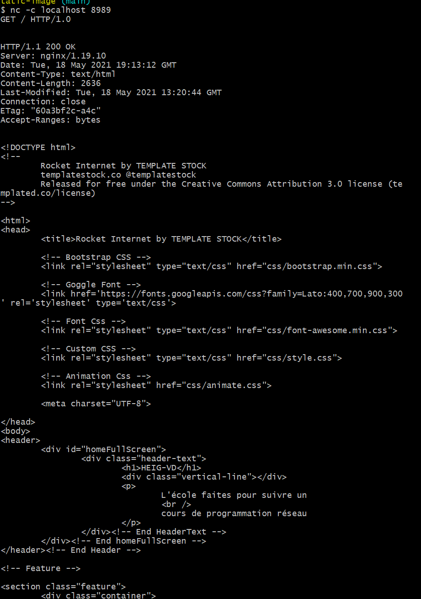

   2. Avec votre navigateur

      

### Fichier de configuration nginx

Pour visualiser le contenu du fichier de configuration, on va créer un container  à partir de l'image, récupérer son id avec `docker ps`, et  ensuite lancer une de ces deux commandes :

- `winpty docker run -it res/nginx-server //bin//bash` (Windows)

- `docker exec -run res/nginx-server /bin/bash` (Linux, Mac)

Dès qu'on est dans le système de fichier, il est possible de visualiser ce fichier de configuration nginx avec `cat /etc/nginx/nginx.conf`

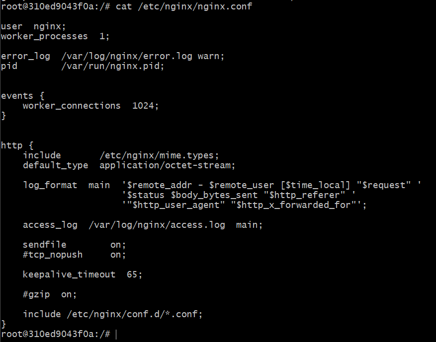

Il s'agit de la configuration de base, donc elle n'est pas très détaillée.

## Partie 2

### Objectif

Nous voulons dans cette partie lancer un container qui génèrera du contenu dynamiquement. Ce contenu doit être au format JSON et accessible depuis un navigateur web.

### Explication de la configuration

#### Exécution hors docker

Toute la configuration s'exécute dans le dossier express-image

La première étape a été d'installer les différents modules utilisés. En l'occurrence: express et chance.

Donc, dans le dossier src :

````bash
npm install --save express
npm install --save chance
````

Express permet de générer des serveurs HTTP très rapidement. Le module Chance quant à lui, permet de générer des données aléatoirement.

Il a fallut modifier ensuite le index.js afin de générer dynamiquement des données.

````javascript
var Chance  = require('chance');
var chance = new Chance();

var express  = require('express');
var app = express();

app.get('/test', function(req, res){
    res.send("Hello RES - test ");
});

app.get("/api/companies", function(req, res){
    res.send(generateCompanies());
});

app.get('/', function(req, res){
    res.send("Welcome on the RES server");
});

app.listen(3000, function () {
    console.log("Accept HTTP requests on port 3000");
});


function generateCompanies(){
    var numberOfCompanies = chance.integer({
        min:0,
        max:10
    });
    console.log("Number of companies generated: " + numberOfCompanies);
    var companies = [];
    for(var i = 0; i < numberOfCompanies; ++i) {
        var companyName = chance.company();
        var companyNameNoSpace = companyName.replace(/\W/g, '');
        companies.push({
            name: companyName,
            adress: chance.address({
                short_suffix: true
            }),
            website: chance.url({
                domain: "www." + companyNameNoSpace + ".com"
            }),
            income: chance.dollar({
                min: 100000,
                max: 1000000000
            })
        });
    }

    console.log(companies);
    return companies;
}

````

Nous avons décidé de générer des entreprises avec leur nom, leur adresse, leur site web, et leurs revenus.

A ce niveau, l'application est déjà exécutable grâce à node. 

Rendez vous dans le dossier src, ouvrez un terminal tapez la commande : 

````bash
node index.js
````

Ceci va lancer l'application et afficher:

````
Accepting HTTP requests on port 3000.
````

Ouvrez ensuite un 2e terminal, et tapez la commande:

````bash
telnet localhost 3000
````

Attendez que la connexion s'exécute puis taper la requête HTTP

````http
GET /api/companies HTTP/1.0
````

Ceci affichera un nombre aléatoire d'entreprise au format JSON, celles-ci générées aléatoirement: 

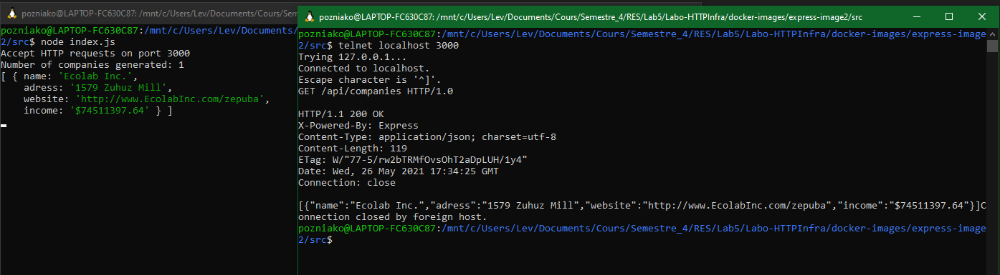

#### Exécution dockerisée

Il faut d'abord écrire le docker file: 

````dockerfile
FROM node:14.17

COPY src /opt/app

CMD ["node", "/opt/app/index.js"]
````

Celui-ci importe node dans sa version 14.17 qui est la version la plus récente. On peut également voir que le docker défini aussi le  fichier javascript appelé. En l'occurence, c'est celui créé précédemment à savoir index.js.

Pour simplifier la création de l'image et l'exécution, nous avons créés 2 scripts: build-image.sh et run-container.sh. Ils doivent être exécuté dans cet ordre afin de créer l'image docker.

build-image:

````bash
#!/bin/bash

docker build -t res/nodeserv .
````

run-container:

````bash
#!/bin/bash
docker run -d -p 9090:3000 res/nodeserv
# -d pour démarre en arrière plan
# -p port-mapping, écoute sur le port 8989 en local de la part du port 80 sur le container
````

Ceci fait, nous vérifions que l'image docker est bien en cours de fonctionnement grâce à la commande ``docker ps``

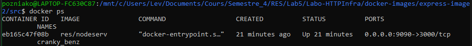

Ainsi nous pouvons n'avons plus qu'à nous rendre sur le navigateur pour exécuter la requête. Pour ce faire, il faut ouvrir le navigateur et dans la bar de recherche taper ``localhost:9090/api/companies``

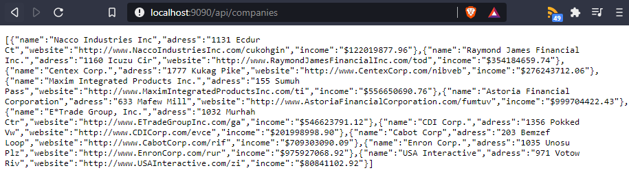

### En bref: démonstration

1. Cloner ce projet
2. Se placer dans le dossier `/docker-image/etape2/express-images`
3. Lancer le script `build-image.sh`
4. Lancer le script `run-container.sh`

A ce moment votre image docker est lancé et fonctionnelle.

5. Sur votre navigateur, dans la bar de recherche tapez: `localhost:9090/api/companies`
6. Le navigateur vous afficher les entreprises générées dynamiquement

## Partie 3

Le but de cette partie est de mettre à disposition un pool de container pour créer un reverse proxy. Le serveur de reverse proxy aura pour but de filtrer les requêtes qu'ils lui seront envoyée, et de les rediriger vers les bon serveurs pour avoir qu'un seul point d'accès au système.

### Configuration

Il y a 3 image docker qu'il faudra créer au préalable pour mettre en place cette configuration.

Les deux première ont déjà été crée dans les étape différentes Il suffit de vous documenter ci-dessus pour les créer), et la dernière est disponible dans le dossier `Labo-HTTPInfra/reverse-proxy` et son implémentation est plus bas dans cette documentation.

#### Fonctionnement

L'infrastructure sera similaire à la suivante : Les deux containeurs des images crées aux étapes précédentes serviront de fournisseurs de ressource au serveur de reverse proxy. Lorsqu'un client souhaitera obtenir du contenu, il contactera le serveur approprié, et renverra le reverse-proxy reverra lui-même les ressource qu'il a pu récupérer. 

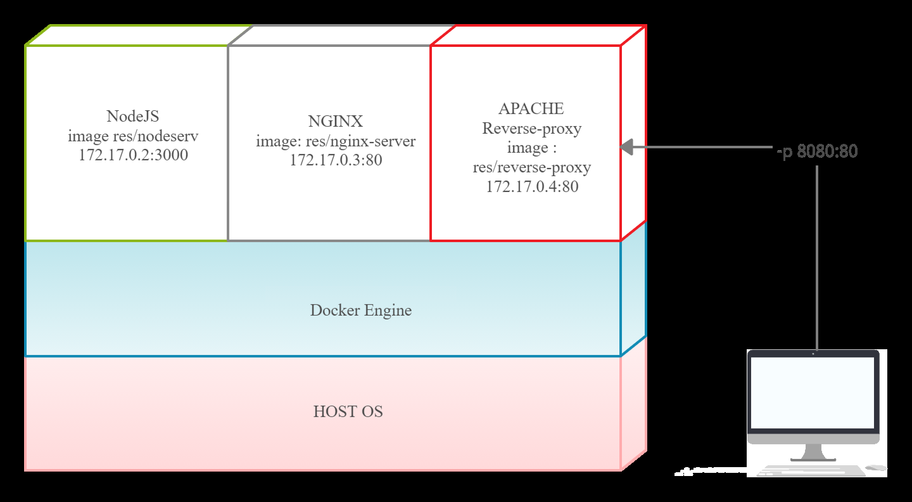

#### Reverse proxy

Premièrement, il faut créer un Dockerfile qui puisse créer le serveur apache reverse-proxy.

**Dockerfile**

```dockerfile
FROM php:7.4-apache

COPY conf/ /etc/apache2 # copie de la configuration locale sur serveur

RUN apt-get update && \
  apt-get install -y vim nano tcpdump netcat net-tools # outils administration

RUN a2enmod proxy proxy_http # module proxy

RUN a2ensite 000-* 001-* #active site
```

On voit sur ce Dockerfile ci-dessus qu'il copie le contenu du dossier conf en local. la structure est la suivante

```
.
├── Dockerfile
└── conf
    └── sites-available
        ├── 000-default.conf
        └── 001-reverse-proxy.conf
```

**000-default.conf**

```
<VirtualHost *:80>
</VirtualHost>
```

Cette configuration étonnante permet de refuser toute les connexions qui ne vont pas en direction de l'hôte `res.heigvf.ch`

**001-reverse-proxy.conf**

```
<VirtualHost *:80>
        ServerName res.heigvd.ch

        #ErrorLog ${APACHE_LOG_DIR}/error.log
        #CustomLog ${APACHE_LOG_DIR}/access.log combined

        ProxyPass "/api/password/" "http://172.17.0.2:3000/" #Node
        ProxyPassReverse "/api/password/" "http://172.17.0.2:3000/"

        ProxyPass "/" "http://172.17.0.3:80/" # nginx statique
        ProxyPassReverse "/" "http://172.17.0.3:80/"
</VirtualHost>
```

Cette configuration va permettre de gérer deux redirection: si l'host de destination est bien `res.heigvd.ch`, alors il va utiliser cette configuration. Si l'URL qui est accédé est `/api/password/`, alors ce sera redirigé vers le serveur Node.js. Pour toute les autre URL, il va regarder sur le serveur statique nginx. 

**Notes** : Il faut bien faire attention à ce que les containers aient les bonnes adresses IP à leur démarrage.

## Démonstration

1. Cloner ce repository

2. Build les images de l'étape 1 et 2 avec leur script respectif `build-image.sh`

3. Allumer les 2 premiers containers dans cette ordre

   1. `docker run -d --name express_dynamic res/nodeserv`
   2. `docker run -d --name nginx_static res/nginx-server`

4. Vérifier que les adresses IP soient les bonnes

   1. `docker inspect express_dynamic | grep -i ipaddress` -> `172.17.0.2`
   2. `docker inspect nginx_static | grep -i ipaddress` -> `172.17.0.3`
   3. Si incorrect, changer fichier `docker-images/reverse-proxy/conf/sites-available/001-reverse-proxy.conf` avec les bonne adresse.

5. Placer vous dans le dossier `docker-images/reverse-proxy` et exécuter le script `build-image.sh`

6. Lancer un container avec `docker run -d -p 8080:80 res/reverse-proxy`

7. Ajouter une correspondance entre votre adresse IP d'accès à vos contrainer (127.0.0.1 pour Docker Desktop ou 192.168.99.100 docker-machine) et l'adresse `res.heigvd.ch`

8. Essayer la configuration

   1. Sur votre navigateur avec l'adresse http://res.heigvd.ch:8080

      

      

   2. En tentant d'accéder au serveur Node via le reverse proxy

      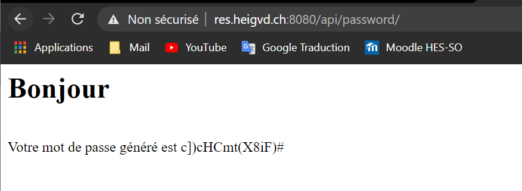

      

   3. Accéder à une page inexistante, le serveur pas défaut retourne un statut 404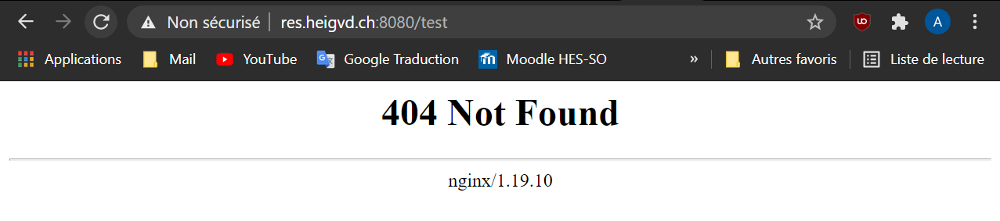

   4. Accéder avec l'adresse ip cible directement ne fonctionne pas non plus car il faut que l'hôte de destination soit le bon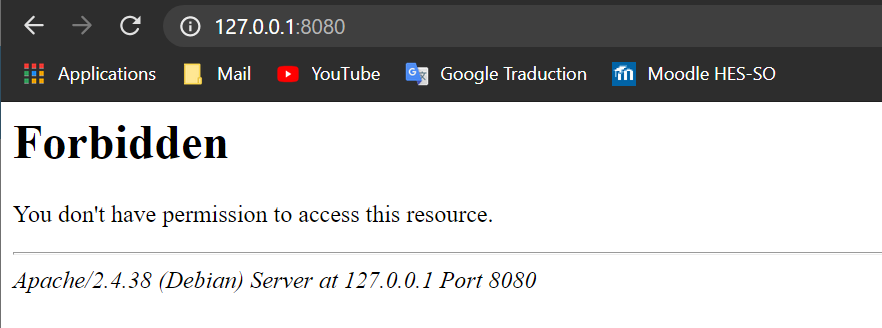


## Partie 4

### Objectif

Le but de cette partie est d'envoyer une requête AJAX périodiquement à notre site.

### Implémentation

#### Modification de fichier système:

Pour pouvoir lancer depuis un navigateur en tapant `` res.heigvd.ch:8080`` sous **windows** il a également fallut modifier un fichier système. Celui-ci est le fichier ``host`` contenu à l'adresse: `C:\Windows\System32\drivers\etc`. Il se présente ainsi:

````
# Copyright (c) 1993-2009 Microsoft Corp.
#
# This is a sample HOSTS file used by Microsoft TCP/IP for Windows.
#
# This file contains the mappings of IP addresses to host names. Each
# entry should be kept on an individual line. The IP address should
# be placed in the first column followed by the corresponding host name.
# The IP address and the host name should be separated by at least one
# space.
#
# Additionally, comments (such as these) may be inserted on individual
# lines or following the machine name denoted by a '#' symbol.
#
# For example:
#
#      102.54.94.97     rhino.acme.com          # source server
#       38.25.63.10     x.acme.com              # x client host

# localhost name resolution is handled within DNS itself.
#	127.0.0.1       localhost
#	::1             localhost

# POUR LE COURS DE RES
127.0.0.1 res.heigvd.ch

# Added by Docker Desktop
192.168.0.192 host.docker.internal
192.168.0.192 gateway.docker.internal
# To allow the same kube context to work on the host and the container:
127.0.0.1 kubernetes.docker.internal
# End of section
````

Nous y avons ajouté la ligne ``127.0.0.1 res.heigvd.ch`` qui va donc faire la correspondance avec le ``localhost`` et le domaine ``res.heigvd.ch``. **Attention** ! Le fichier doit-être ouvert en tant qu'administrateur pour pouvoir être modifié.

#### Modification d'outils existants

Tout les outils nécessaires au bon fonctionnement de cette étape sont disponible dans le dossier etape_4.

Dans un premier temps nous avons récupéré les travaux effectué dans les étapes précédentes. A savoir: 

- L'image docker express
- L'image docker nginx pour le site statique
- L'image docker du reverse proxy

Celle-ci ont du subir quelques légère modification, en effet, nous avons installé vim sur toutes les machines et d'autres outils. Il a donc fallut ajouter la ligne suivante dans tous les dockerfile:

````dockerfile
RUN apt-get update && \
  apt-get install -y vim nano tcpdump netcat net-tools
````

La commande ``RUN`` du docker file va exécuter les lignes de commandes et dans notre cas installer plusieurs outils.

Ensuite, il a fallu modifier légèrement le index.js de l'express-image:

````javascript
var Chance  = require('chance');
var chance = new Chance();

var express  = require('express');
var app = express();

app.get("/", function(req, res){
    res.send(generateCompanies());
});

app.listen(3000, function () {
    console.log("Accept HTTP requests on port 3000");
});


function generateCompanies(){
    var numberOfCompanies = chance.integer({
        min:0,
        max:10
    });
    console.log("Number of companies generated: " + numberOfCompanies);
    var companies = [];
    for(var i = 0; i < numberOfCompanies; ++i) {
        var companyName = chance.company();
        var companyNameNoSpace = companyName.replace(/\W/g, '');
        companies.push({
            name: companyName,
            adress: chance.address({
                short_suffix: true
            }),
            website: chance.url({
                domain: "www." + companyNameNoSpace + ".com"
            }),
            income: chance.dollar({
                min: 100000,
                max: 1000000000
            })
        });
    }

    console.log(companies);
    return companies;
}

````

En effet, il a fallut modifier l'appel à ``/api/companies`` puisque le reverse proxy ne fera la correspondance qu'avec l'appel à ``/``. Le fichier de configuration du reverse-proxy est le suivant:

````xml
<VirtualHost *:80>
        ServerName res.heigvd.ch

        #ErrorLog ${APACHE_LOG_DIR}/error.log
        #CustomLog ${APACHE_LOG_DIR}/access.log combined

        ProxyPass "/api/companies/" "http://172.17.0.2:3000/"
        ProxyPassReverse "/api/companies/" "http://172.17.0.2:3000/"

        ProxyPass "/" "http://172.17.0.3:80/"
        ProxyPassReverse "/" "http://172.17.0.3:80/"
</VirtualHost>

# vim: syntax=apache ts=4 sw=4 sts=4 sr noet
````

Et nous pouvons y voir, que la correspondance avec ``api/companies/`` se fait avec ``http://172.17.0.2:3000/`` soit l'appel à ``/``

Le reverse proxy ne nécessite aucune modification. 

Enfin nous avons du modifier le site statique afin d'avoir un champ mis à jour par des requêtes ajax périodiques. Dans un premier temps, nous avons créé ce champ dans le code source de la page web définie par le fichier index.html de l'image nginx.

````html
<!DOCTYPE html>
<!--
	Rocket Internet by TEMPLATE STOCK
	templatestock.co @templatestock
	Released for free under the Creative Commons Attribution 3.0 license (templated.co/license)
-->

<html>
<head>
	<title>Rocket Internet by TEMPLATE STOCK</title>

	<!-- Bootstrap CSS -->
	<link rel="stylesheet" type="text/css" href="css/bootstrap.min.css">

	<!-- Goggle Font -->
	<link href='https://fonts.googleapis.com/css?family=Lato:400,700,900,300' rel='stylesheet' type='text/css'>

	<!-- Font Css -->
	<link rel="stylesheet" type="text/css" href="css/font-awesome.min.css">

	<!-- Custom CSS -->
	<link rel="stylesheet" type="text/css" href="css/style.css">

	<!-- Animation Css -->
	<link rel="stylesheet" href="css/animate.css">
	
	<meta charset="UTF-8">

</head>
<body>
<header>
	<div id="homeFullScreen">
		<div class="header-text">
			<h1>HEIG-VD !!</h1>
			<div class="vertical-line"></div>
			<p>
				L'école faites pour suivre un 
				<br />
				cours de programmation réseau
			</p>
			<b><span style="color:red" class="company">Ici il y a des entreprises!</span></b>
			<br />
			<span style="color:deepskyblue" class="website">Ici il y a un site internet</span>
		</div><!-- End HeaderText -->
	</div><!-- End homeFullScreen -->
</header><!-- End Header -->

<!-- Feature -->

<section class="feature">
	<div class="container">
		<div class="row">
			<div class="col-md-6 col-sm-6">
				<div class="feature-box">
					<h1>RES</h1>
					<p>Vous apprendrez à tout faire, des sockets à la configuration docker</p>
				</div>
			</div><!-- End col-md-6 -->
			<div class="col-md-6 col-sm-6 nopadding">
				
			</div><!-- End col-md-6 -->

			<div class="clearfix"></div><!-- End clearfix -->

			<div class="col-md-6 col-sm-6 nopadding">
				
			</div><!-- End col-md-6 -->
			<div class="col-md-6 col-sm-6">
				<div class="feature-box">
					<h1>Attendez plus !</h1>
					<p>Venez profitez de ce cours depuis chez vous</p>
				</div>
			</div><!-- End col-md-6 -->
		</div>
	</div>
</section>

<!-- Footer -->
<footer>
	<ul class="in-line">
		<li><a href="https://www.youtube.com/watch?v=XFO4OmcfI3U"><span><i class="fa fa-youtube"></i></span></a></li>
	</ul>
	<span class="copyright">&#169; HEIG-VD . All rights reserved. Design By <a href="http://templatestock.co">Templatestock.co</a></span>
</footer>
	


<!-- Main JS -->
<script type="text/javascript" src="js/jquery-main.js"></script>

<!-- Bootstrap JS -->
<script type="text/javascript" src="js/bootstrap.min.js"></script>

<!-- Animation JS -->
<script type="text/javascript" src="js/wow.min.js"></script>

<!-- Custom JS -->
<script type="text/javascript" src="js/custom.js"></script>

<!-- Custom script -->
<script src="js/myscript.js"></script>

<!-- Custom script to load random companies-->
<script src="js/companies.js"></script>

</body>
</html>
````

Les champs: ``company`` et ``website`` du header seront ceux qui seront mis à jour. Nous leurs avons assignés des couleurs pour qu'ils soient plus visible. 

Ces champs définis il nous reste à les remplir. 

Pour cela, nous avons créé un script javascript qui est dans le dossier ``nginx-static-image/src/js`` et qui se nomme ``companies.js``:

````javascript
$(function() {
    console.log("Loading companies...");
    function loadCompanies() {
        $.getJSON("api/companies/", function (companies) {
            console.log(companies);
            var messageCompany = "No company here";
            var messageWebsite = "No website here";
            //récupères les premières données générées par api/companies
            if (companies.length > 0) {
                messageCompany = companies[0].name;
                messageWebsite = companies[0].website;
            }
            //Assignation aux champs
            $(".company").text(messageCompany);
            $(".website").text(messageWebsite);
        });
    };
	
    loadCompanies();
    //timer pour reload les données toutes les 3 secondes.
    setInterval(loadCompanies, 3000);

});
````

Celui-ci va exécuter ``api/companies`` pour récupérer les données générées dynamiquement et les assigner dans les champs ``company`` et ``website``. La fonction setInterval va exécuter le script périodiquement, dans notre cas, toutes les 3 secondes.

Ceci fait, les images docker sont lançables et fonctionnelles ! 

### Démonstration

La procédure doit-être respectée scrupuleusement sans quoi le site ne fonctionnera pas.

1. Si vous avez déjà exécuté cette partie du projet, supprimez tous les containers et toutes les images docker relatives à cette partie.
2. Build les images express, et nginx_static avec leur script respectif `build-image.sh`
3. Allumer les 2 premiers containers dans cette ordre

   1. `docker run -d --name express_dynamic res/nodeserv`
   2. `docker run -d --name nginx_static res/nginx-server`
4. Vérifier que les adresses IP soient les bonnes

   1. `docker inspect express_dynamic | grep -i ipaddress` -> `172.17.0.2`
   2. `docker inspect nginx_static | grep -i ipaddress` -> `172.17.0.3`
   3. Si incorrect, changer fichier `docker-images/reverse-proxy/conf/sites-available/001-reverse-proxy.conf` avec les bonne adresse. Puis recommencez cette procédure.
5. Placer vous dans le dossier `docker-images/reverse-proxy` et exécuter le script `build-image.sh`
6. Lancer un container avec `docker run -d -p 8080:80 res/reverse-proxy`
7. Essayer la configuration

   1. Sur votre navigateur avec l'adresse http://res.heigvd.ch:8080


Vous pourrez constater que les 2 champs en rouge et bleu sont mis à jour périodiquement.

La fonction ``api/companies`` est toujours fonctionnelle, puisque si vous vous rendez sur la page ``res.heigvd.ch:8080/api/companies`` vous pourrez toujours consulter les entreprises générée dynamiquement:

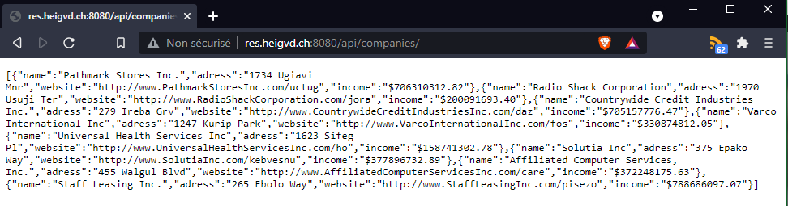

## Etape 5

Le problème de l'étape 3 est qu'on est dépendant de l'adresse IP de chaque machine pour que le reverse proxy fonctionne. On va utiliser deux méthodes, la première est l'utilisation des variables environnements lors du run du container pour qu'il puisse connaître les adresses IP des deux serveurs web, et la deuxième est l'utilisation d'un script PHP qui va créer une configuration pour le reverse proxy avec les IP qu'il récupère via des variables d'environnement passées par Docker.

### Démonstration

1. Cloner ce repository
2. Build les images de l'étape 1 et 2 avec leur script respectif `build-image.sh`
3. Allumer ces 2 premiers containers n'importe quel ordre : 

   1. `docker run -d --name express_dynamic res/nodeserv`
   2. `docker run -d --name nginx_static res/nginx-server`

4. Récupérer les adresses IP de chaque serveur
   1. `docker inspect express_dynamic | grep -i ipaddress` -> `DYNAMIC_APP`
   2. `docker inspect nginx_static | grep -i ipaddress` -> `STATICAPP`
5.  Placer vous dans le dossier `docker-images/reverse-proxy` et exécuter le script `build-image.sh`

6. Lancer un container avec ` docker run -e STATIC_APP=172.17.0.3:80 -e DYNAMIC_APP=172.17.0.2:3000 -p 8080:80 res/reverse-proxy` En spécifiant les bonne adresse IP en fonction de ce qui a été récupéré à l'étape 4 de cette démonstration.

   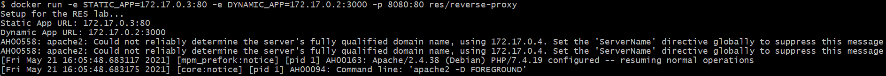

   Malgrès les messages d'erreur, le serveur est tout de même fonctionnel.

7. Accéder au site 

   

   

### Configuration

Nous avons du rajouter plusieurs fichiers pour permettre de mettre en place cette implémentation

**/docker-images/reverse-proxy/apache2-foreground**

```
#!/bin/bash
set -e

# Add setup for part 5 of RES labo
echo "Setup for the RES lab..."
echo "Static App URL: $STATIC_APP"
echo "Dynamic App URL: $DYNAMIC_APP"
php /var/apache2/templates/config-template.php > /etc/apache2/sites-available/001-reverse-proxy.conf

# Note: we don't just use "apache2ctl" here because it itself is just a shell-script wrapper around apache2 which provides extra functionality like "apache2ctl start" for launching apache2 in the background.
# (also, when run as "apache2ctl <apache args>", it does not use "exec", which leaves an undesirable resident shell process)

: "${APACHE_CONFDIR:=/etc/apache2}"
: "${APACHE_ENVVARS:=$APACHE_CONFDIR/envvars}"
if test -f "$APACHE_ENVVARS"; then
        . "$APACHE_ENVVARS"
fi

# Apache gets grumpy about PID files pre-existing
: "${APACHE_RUN_DIR:=/var/run/apache2}"
: "${APACHE_PID_FILE:=$APACHE_RUN_DIR/apache2.pid}"
rm -f "$APACHE_PID_FILE"

# create missing directories
# (especially APACHE_RUN_DIR, APACHE_LOCK_DIR, and APACHE_LOG_DIR)
for e in "${!APACHE_@}"; do
        if [[ "$e" == *_DIR ]] && [[ "${!e}" == /* ]]; then
                # handle "/var/lock" being a symlink to "/run/lock", but "/run/lock" not existing beforehand, so "/var/lock/something" fails to mkdir
                #   mkdir: cannot create directory '/var/lock': File exists
                dir="${!e}"
                while [ "$dir" != "$(dirname "$dir")" ]; do
                        dir="$(dirname "$dir")"
                        if [ -d "$dir" ]; then
                                break
                        fi
                        absDir="$(readlink -f "$dir" 2>/dev/null || :)"
                        if [ -n "$absDir" ]; then
                                mkdir -p "$absDir"
                        fi
                done

                mkdir -p "${!e}"
        fi
done

exec apache2 -DFOREGROUND "$@"

```

Ce script a été récupéré sur le github https://github.com/docker-library/php/tree/47e681a74116da5a99e804bef5a7808df40d831f/7.4/buster/apache, et a été créé par le fournisseurs de l'image parent. Nous l'avons récupéré et avons rajouter quelque lignes supplémentaires afin d'avoir une vue sur ce qui se passe lors de la création d'un container à partir de notre image, et aussi pour exécuter en php le template qui contient la configuration dynamique de notre proxy. Ce script en local a la priorité sur le script qui était sensé être importé depuis `docker hub`.

**docker-images/reverse-proxy/templates/config-template.php**

```php
<?php
        $ip_static = getenv('STATIC_APP');
        $ip_dynamic = getenv('DYNAMIC_APP');
?>
<VirtualHost *:80>
        ServerName res.heigvd.ch

        #ErrorLog ${APACHE_LOG_DIR}/error.log
        #CustomLog ${APACHE_LOG_DIR}/access.log combined

        ProxyPass '/api/password/' 'http://<?php print $ip_dynamic ?>/'
        ProxyPassReverse '/api/password/' 'http://<?php print $ip_dynamic ?>/'

        ProxyPass '/' 'http://<?php print $ip_static ?>/'
        ProxyPassReverse '/' 'http://<?php print $ip_static ?>/'
</VirtualHost>

```

Ce script `php` va être exécuté dans le script présenté ci-dessus pour écraser le fichier de configuration `/etc/apache2/sites-available/001-reverse-proxy.conf`. Il va récupérer les variables d'environnement fournies lors du build du container pour avoir les adresses IP du serveur statique et du serveur dynamique de manière dynamique, car auparavant nous étions obligé de supposé qu'elles avaient été allumé dans un ordre précis. 

**docker-images/reverse-proxy/Dockerfile**

```dockerfile
FROM php:7.4-apache

COPY apache2-foreground /usr/local/bin/

COPY conf/ /etc/apache2/
COPY templates/ /var/apache2/templates/

RUN apt-get update && \
  apt-get install -y vim nano tcpdump netcat net-tools

RUN a2enmod proxy proxy_http && a2ensite 000-* 001-* #active les configurations du proxy
```

Nous avons été obligé du coup de modifier le Dockerfile, afin de pouvoir copier nos deux nouveau script.