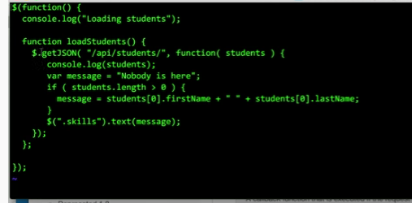

# Labo-HTTPInfra

Ce github contient le différentes étapes pour créer une infrastructure web sur Docker. Les différentes étape permettent au lecteur de créer progressivement son infrastructure. Il est possible que certains fichiers ne soient plus disponible dans leur état présenté, car ils ont été modifier pour exécuter les étapes suivantes, mais vous pourrez toujours modifier les fichiers cibles avec leur contenu qui sont présenté dans la configuration de chacune des étapes.

## Etape 1

L'objectif de cette partie est la création d'un serveur web "dockerisé" servant du serveur statique.

### Configuration

La configuration de cette partie est disponible dans le dossier `./docker-images/nginx-static-image`

Vous trouvez trois fichier

**Dockerfile**

```dockerfile
FROM nginx
# COPY nginx.conf /etc/nginx/nginx.conf
COPY src /usr/share/nginx/html
```

Celui-ci est le fichier Dockerfile qui va importer le serveur nginx dans le contrainer est ce qu'il aura besoin.  On visulise que si on enlève le commentaire, et place dans ce répertoire une configuration nginx personnelle, alors celle-ci sera mise à jour. La dernière ligne copie le site qui sera publié sur le serveur web.

**build-images.sh**

```
#!/bin/bash
docker build -t res/nginx-server .
```

Ce script permet simplement de créer une image avec le Dockerfile

**run-container.sh**

```
docker run -d -p 8989:80 res/nginx-server
# -d pour démarre en arrière plan
# -p port-mapping, écoute sur le port 8989 en local de la part du port 80 sur le container
```

Ce script permet de créer un container avec l'image préalablement crée. Il ouvre un port http du serveur sur le port 8989. Ce script est seulement utile pour observer un accès à ce site statique.

### Démonstration

1. Cloner ce projet

2. Se placer dans le dossier `/docker-images/nginx-static-image`

3. Lancer la commande `./build-image.sh` Cette opération peut prendre quelque minutes, car elle importe l'image nginx.

4. Lancer la commande `./run-container.sh`. Elle va ouvrir le port 8989 en localhost (ou si Docker-Machine une autre adresse)

5. Accéder au contenu de la page pour vérifier son contenu

   1. Avec votre invite de commande 

      

   2. Avec votre navigateur

      

### Fichier de configuration nginx

Pour visualiser le contenu du fichier de configuration, on va créer un container  à partir de l'image, récupérer son id avec `docker ps`, et  ensuite lancer une de ces deux commandes :

- `winpty docker run -it res/nginx-server //bin//bash` (Windows)

- `docker exec -run res/nginx-server /bin/bash` (Linux, Mac)

Dès qu'on est dans le système de fichier, il est possible de visualiser ce fichier de configuration nginx avec `cat /etc/nginx/nginx.conf`


Il s'agit de la configuration de base, donc elle n'est pas très détaillée.

## Partie 2


## Partie 3

Le but de cette partie est de mettre à disposition un pool de container pour créer un reverse proxy. Le serveur de reverse proxy aura pour but de filtrer les requêtes qu'ils lui seront envoyée, et de les rediriger vers les bon serveurs pour avoir qu'un seul point d'accès au système.

### Configuration

Il y a 3 image docker qu'il faudra créer au préalable pour mettre en place cette configuration.

Les deux première ont déjà été crée dans les étape différentes Il suffit de vous documenter ci-dessus pour les créer), et la dernière est disponible dans le dossier `Labo-HTTPInfra/reverse-proxy` et son implémentation est plus bas dans cette documentation.

#### Fonctionnement

L'infrastructure sera similaire à la suivante : Les deux containeurs des images crées aux étapes précédentes serviront de fournisseurs de ressource au serveur de reverse proxy. Lorsqu'un client souhaitera obtenir du contenu, il contactera le serveur approprié, et renverra le reverse-proxy reverra lui-même les ressource qu'il a pu récupérer. 


#### Reverse proxy

Premièrement, il faut créer un Dockerfile qui puisse créer le serveur apache reverse-proxy.

**Dockerfile**

```dockerfile
FROM php:7.4-apache

COPY conf/ /etc/apache2 # copie de la configuration locale sur serveur

RUN apt-get update && \
  apt-get install -y vim nano tcpdump netcat net-tools # outils administration

RUN a2enmod proxy proxy_http # module proxy

RUN a2ensite 000-* 001-* #active site
```

On voit sur ce Dockerfile ci-dessus qu'il copie le contenu du dossier conf en local. la structure est la suivante

```
.
├── Dockerfile
└── conf
    └── sites-available
        ├── 000-default.conf
        └── 001-reverse-proxy.conf
```

**000-default.conf**

```
<VirtualHost *:80>
</VirtualHost>
```

Cette configuration étonnante permet de refuser toute les connexions qui ne vont pas en direction de l'hôte `res.heigvf.ch`

**001-reverse-proxy.conf**

```
<VirtualHost *:80>
        ServerName res.heigvd.ch

        #ErrorLog ${APACHE_LOG_DIR}/error.log
        #CustomLog ${APACHE_LOG_DIR}/access.log combined

        ProxyPass "/api/password/" "http://172.17.0.2:3000/" #Node
        ProxyPassReverse "/api/password/" "http://172.17.0.2:3000/"

        ProxyPass "/" "http://172.17.0.3:80/" # nginx statique
        ProxyPassReverse "/" "http://172.17.0.3:80/"
</VirtualHost>
```

Cette configuration va permettre de gérer deux redirection: si l'host de destination est bien `res.heigvd.ch`, alors il va utiliser cette configuration. Si l'URL qui est accédé est `/api/password/`, alors ce sera redirigé vers le serveur Node.js. Pour toute les autre URL, il va regarder sur le serveur statique nginx. 

**Notes** : Il faut bien faire attention à ce que les containers aient les bonnes adresses IP à leur démarrage.

## Démonstration

1. Cloner ce repository

2. Build les images de l'étape 1 et 2 avec leur script respectif `build-image.sh`

3. Allumer les 2 premiers containers dans cette ordre

   1. `docker run -d --name express_dynamic res/nodeserv`
   2. `docker run -d --name nginx_static res/nginx-server`

4. Vérifier que les adresses IP soient les bonnes

   1. `docker inspect express_dynamic | grep -i ipaddress` -> `172.17.0.2`
   2. `docker inspect nginx_static | grep -i ipaddress` -> `172.17.0.3`
   3. Si incorrect, changer fichier `docker-images/reverse-proxy/conf/sites-available/001-reverse-proxy.conf` avec les bonne adresse.

5. Placer vous dans le dossier `docker-images/reverse-proxy` et exécuter le script `build-image.sh`

6. Lancer un container avec `docker run -d -p 8080:80 res/reverse-proxy`

7. Ajouter une correspondance entre votre adresse IP d'accès à vos contrainer (127.0.0.1 pour Docker Desktop ou 192.168.99.100 docker-machine) et l'adresse `res.heigvd.ch`

8. Essayer la configuration

   1. Sur votre navigateur avec l'adresse http://res.heigvd.ch:8080

      

      

   2. En tentant d'accéder au serveur Node via le reverse proxy

      

      

   3. Accéder à une page inexistante, le serveur pas défaut retourne un statut 404

   4. Accéder avec l'adresse ip cible directement ne fonctionne pas non plus car il faut que l'hôte de destination soit le bon


## Etape 4

Doit faire script adapté



Ajouter appel de fonction load() à la fin du script.

load();

setIntervals( load, 2000 ); // toutes les 2000 ms ça change automatiquement.

remplacer un bout dans code dans html avec <span class="skills" ... >

## Etape 5

Le problème de l'étape 3 est qu'on est dépendant de l'adresse IP de chaque machine pour que le reverse proxy fonctionne. On va utiliser deux méthodes, la première est l'utilisation des variables environnements lors du run du container pour qu'il puisse connaître les adresses IP des deux serveurs web, et la deuxième est l'utilisation d'un script PHP qui va créer une configuration pour le reverse proxy avec les IP qu'il récupère via des variables d'environnement passées par Docker.

### Démonstration

1. Cloner ce repository
2. Build les images de l'étape 1 et 2 avec leur script respectif `build-image.sh`
3. Allumer ces 2 premiers containers n'importe quel ordre : 

   1. `docker run -d --name express_dynamic res/nodeserv`
   2. `docker run -d --name nginx_static res/nginx-server`

4. Récupérer les adresses IP de chaque serveur
   1. `docker inspect express_dynamic | grep -i ipaddress` -> `DYNAMIC_APP`
   2. `docker inspect nginx_static | grep -i ipaddress` -> `STATICAPP`
5.  Placer vous dans le dossier `docker-images/reverse-proxy` et exécuter le script `build-image.sh`

6. Lancer un container avec ` docker run -e STATIC_APP=172.17.0.3:80 -e DYNAMIC_APP=172.17.0.2:3000 -p 8080:80 res/reverse-proxy` En spécifiant les bonne adresse IP en fonction de ce qui a été récupéré à l'étape 4 de cette démonstration.

   

   Malgrès les messages d'erreur, le serveur est tout de même fonctionnel.

7. Accéder au site 

   

   

### Configuration

Nous avons du rajouter plusieurs fichiers pour permettre de mettre en place cette implémentation

**/docker-images/reverse-proxy/apache2-foreground**

```
#!/bin/bash
set -e

# Add setup for part 5 of RES labo
echo "Setup for the RES lab..."
echo "Static App URL: $STATIC_APP"
echo "Dynamic App URL: $DYNAMIC_APP"
php /var/apache2/templates/config-template.php > /etc/apache2/sites-available/001-reverse-proxy.conf

# Note: we don't just use "apache2ctl" here because it itself is just a shell-script wrapper around apache2 which provides extra functionality like "apache2ctl start" for launching apache2 in the background.
# (also, when run as "apache2ctl <apache args>", it does not use "exec", which leaves an undesirable resident shell process)

: "${APACHE_CONFDIR:=/etc/apache2}"
: "${APACHE_ENVVARS:=$APACHE_CONFDIR/envvars}"
if test -f "$APACHE_ENVVARS"; then
        . "$APACHE_ENVVARS"
fi

# Apache gets grumpy about PID files pre-existing
: "${APACHE_RUN_DIR:=/var/run/apache2}"
: "${APACHE_PID_FILE:=$APACHE_RUN_DIR/apache2.pid}"
rm -f "$APACHE_PID_FILE"

# create missing directories
# (especially APACHE_RUN_DIR, APACHE_LOCK_DIR, and APACHE_LOG_DIR)
for e in "${!APACHE_@}"; do
        if [[ "$e" == *_DIR ]] && [[ "${!e}" == /* ]]; then
                # handle "/var/lock" being a symlink to "/run/lock", but "/run/lock" not existing beforehand, so "/var/lock/something" fails to mkdir
                #   mkdir: cannot create directory '/var/lock': File exists
                dir="${!e}"
                while [ "$dir" != "$(dirname "$dir")" ]; do
                        dir="$(dirname "$dir")"
                        if [ -d "$dir" ]; then
                                break
                        fi
                        absDir="$(readlink -f "$dir" 2>/dev/null || :)"
                        if [ -n "$absDir" ]; then
                                mkdir -p "$absDir"
                        fi
                done

                mkdir -p "${!e}"
        fi
done

exec apache2 -DFOREGROUND "$@"

```

Ce script a été récupéré sur le github https://github.com/docker-library/php/tree/47e681a74116da5a99e804bef5a7808df40d831f/7.4/buster/apache, et a été créé par le fournisseurs de l'image parent. Nous l'avons récupéré et avons rajouter quelque lignes supplémentaires afin d'avoir une vue sur ce qui se passe lors de la création d'un container à partir de notre image, et aussi pour exécuter en php le template qui contient la configuration dynamique de notre proxy. Ce script en local a la priorité sur le script qui était sensé être importé depuis `docker hub`.

**docker-images/reverse-proxy/templates/config-template.php**

```php
<?php
        $ip_static = getenv('STATIC_APP');
        $ip_dynamic = getenv('DYNAMIC_APP');
?>
<VirtualHost *:80>
        ServerName res.heigvd.ch

        #ErrorLog ${APACHE_LOG_DIR}/error.log
        #CustomLog ${APACHE_LOG_DIR}/access.log combined

        ProxyPass '/api/password/' 'http://<?php print $ip_dynamic ?>/'
        ProxyPassReverse '/api/password/' 'http://<?php print $ip_dynamic ?>/'

        ProxyPass '/' 'http://<?php print $ip_static ?>/'
        ProxyPassReverse '/' 'http://<?php print $ip_static ?>/'
</VirtualHost>

```

Ce script `php` va être exécuté dans le script présenté ci-dessus pour écraser le fichier de configuration `/etc/apache2/sites-available/001-reverse-proxy.conf`. Il va récupérer les variables d'environnement fournies lors du build du container pour avoir les adresses IP du serveur statique et du serveur dynamique de manière dynamique, car auparavant nous étions obligé de supposé qu'elles avaient été allumé dans un ordre précis. 

**docker-images/reverse-proxy/Dockerfile**

```dockerfile
FROM php:7.4-apache

COPY apache2-foreground /usr/local/bin/

COPY conf/ /etc/apache2/
COPY templates/ /var/apache2/templates/

RUN apt-get update && \
  apt-get install -y vim nano tcpdump netcat net-tools

RUN a2enmod proxy proxy_http && a2ensite 000-* 001-* #active les configurations du proxy
```

Nous avons été obligé du coup de modifier le Dockerfile, afin de pouvoir copier nos deux nouveau script.