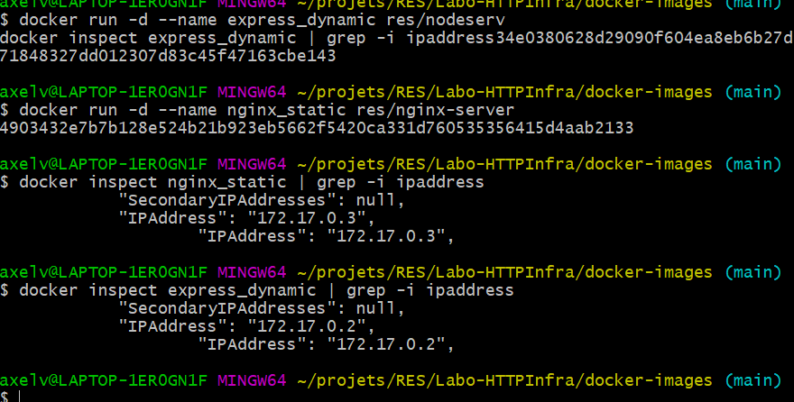

# Labo-HTTPInfra

## Etape 1

L'objectif de cette partie est la création d'un serveur web "dockerisé" servant du serveur statique

### Configuration

La configuration de cette partie est disponible dans le dossier `./docker-images/nginx-static-image`

Vous trouvez trois fichier

**Dockerfile**

```dockerfile
FROM nginx
# COPY nginx.conf /etc/nginx/nginx.conf
COPY src /usr/share/nginx/html
```

Celui-ci est le fichier Dockerfile qui va importer le serveur nginx dans le contrainer est ce qu'il aura besoin.  On visulise que si on enlève le commentaire, et place dans ce répertoire une configuration nginx personnelle, alors celle-ci sera mise à jour. La dernière ligne copie le site qui sera publié sur le serveur web.

**build-images.sh**

```
#!/bin/bash
docker build -t res/nginx-server .
```

Ce script permet simplement de créer une image avec le Dockerfile

**run-container.sh**

```
docker run -d -p 8989:80 res/nginx-server
# -d pour démarre en arrière plan
# -p port-mapping, écoute sur le port 8989 en local de la part du port 80 sur le container
```

Ce script permet de créer un container avec l'image préalablement crée. Il ouvre un port http du serveur sur le port 8989.

### Démonstration

1. Cloner ce projet

2. Se placer dans le dossier `/docker-images/nginx-static-image`

3. Lancer la commande `./build-image.sh` Cette opération peut prendre quelque minutes, car elle importe l'image nginx.

4. Lancer la commande `./run-container.sh`. Elle va ouvrir le port 8989 en localhost (ou si Docker-Machine une autre adresse)

5. Accéder au contenu de la page pour vérifier son contenu

   1. Avec votre invite de commande 

      

   2. Avec votre navigateur

      

### Fichier de configuration du serveur

Pour visualiser le contenu du fichier de configuration, on va créer un container  à partir de l'image, récupérer son id avec `docker ps`, et  ensuite lancer une de ces deux commandes :

- `winpty docker exec -it res/nginx-server //bin//bash` (Windows)

- `docker exec -it res/nginx-server /bin/bash` (Linux, Mac)

Dès qu'on est dans le système de fichier, il est possible de visualiser ce fichier de configuration nginx avec `cat /etc/nginx/nginx.conf`


Il s'agit de la configuration de base, donc elle n'est pas encore très détaillée.

## Partie 2


## Partie 3

```
docker run -d --name express_dynamic res/nodeserv
docker run -d --name nginx_static res/nginx-server
docker inspect nginx_static | grep -i ipaddress
docker inspect express_dynamic | grep -i ipaddress
```



```
<VirtualHost *:80>
        ServerName res.heigvd.ch

        ErrorLog ${APACHE_LOG_DIR}/error.log
        CustomLog ${APACHE_LOG_DIR}/access.log combined

        ProxyPass "/api/password/" "http://172.17.0.2:3000/"
        ProxyPassReverse "/api/password/" "http://172.17.0.2:3000/"

        ProxyPass "/" "http://172.17.0.3:80/"
        ProxyPassReverse "/" "http://172.17.0.3:80/"
</VirtualHost>

# vim: syntax=apache ts=4 sw=4 sts=4 sr noet
```

a2ensite 001*

a2enmod proxy (proxy_http pas necessaire)

service apache2 restart

